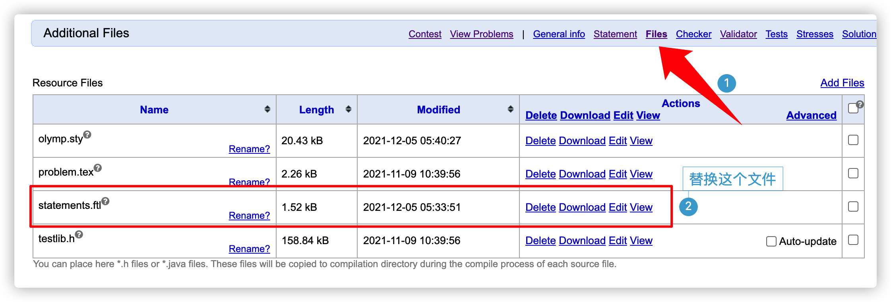

# Polygon-Tutorial

[CF 出题人手册](https://docs.google.com/document/d/e/2PACX-1vRhazTXxSdj7JEIC7dp-nOWcUFiY8bXi9lLju-k6vVMKf4IiBmweJoOAMI-ZEZxatXF08I9wMOQpMqC/pub)

## statement

### basic

题面使用的是 $\TeX$ 语法, 而非`Markdown`，但其实是 $\TeX$ 语法中的一个很小的子集。

常用语法：

- 加粗：`\texttt{}`，例如：`\texttt{dd}`，效果：**dd**
- 斜体：`\textit{}`，例如：`\textit{dd}`，效果：*dd*
- 加粗和斜体可以嵌套使用，即`\texttt{\textit{dd}}`，效果：***dd***
- 数学公式：
	- 行内公式直接用单`$`符号包含即可。
	- 行间公式如果用双`$`符号包含, 可能会出问题，具体如何可以自己尝试。
- 无序列表：
	```latex
	\begin{itemize}
	\item 元素一
	\item 元素二
	\item 元素三
	\end{itemize}
	```
- 有序列表：
	```latex
	\begin{enumerate}
	\item 元素一
	\item 元素二
	\item 元素三
	\end{enumerate}
	```
- 图片：
	```latex
	\begin{figure}[ht]
	\centering  %居中显示
	\includegraphics[scale=0.12]{./statements-hznu_title_min.png} % 插入图片
	\end{figure}
	```
	
	在 `ctex` 环境下，可能获取不到图片的大小，需要加入 `natwidth` 和 `natheight`：
	```latex
	\begin{center}
	\includegraphics[width=16cm,height=12cm,natwidth=1202,natheight=1090]{gen_code.png} % 插入图片
	\end{center}
	```
- 引言：
	```latex
	\epigraph{没有榜单的 *CPC 比赛怎么能称之为比赛？}{Hsueh-}
	```
- 居左、中、右:
	```latex
	\begin{flushleft|center|flushright}
	\end{flushleft|center|flushright}
	```

### 使用中文



用 [statements.ftl](./template/statements.ftl) 进行替换。
